<a href="https://u-szeged.hu/">
    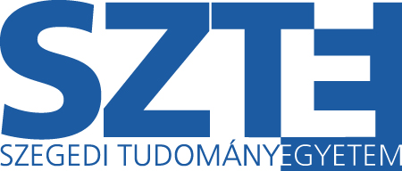
</a>

<h1>
    Szegedi Tudományegyetem   Informatikai Intézet
</h1>
<h2>Ujjlenyomat analízis és párosítás képi adatbázisból</h2>

    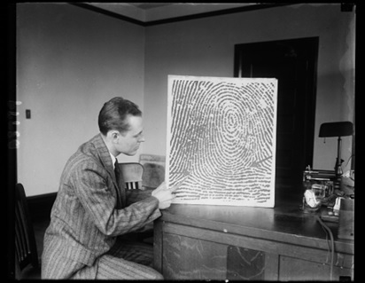

Az adatbázis 520 db képet (326×357 méretű) tartalmazott, mely 7 önkéntes ujjlenyomatait tartalmazza. Hat önkéntes mindkét kezéről, mind a 10 ujjáról 8 db felvétel készült (6*10*8=480), egy önkéntes egy keze került csak beolvasásra (1*5*8=40). Ez a későbbiekben 65 darab osztályt add meg. A képi adatokat egy optikai scanner segítségével gyűjtötték be.

<h3>Szegmentáció</h3>

    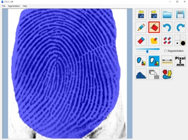

Először a tényleges ujjlenyomatot kellett elválasztani a háttértől és egyéb információktól, ehhez először pár képet manuálisan szegmentálni kell, majd a megfelelő jellemzők alapján el lehet dönteni a kép adott részéről, hogy az releváns információt tartalmaz vagy sem.

<i>Osztályozott pontok érték alapján</i>
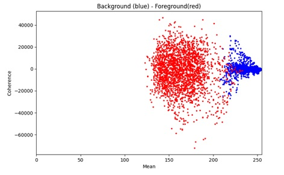
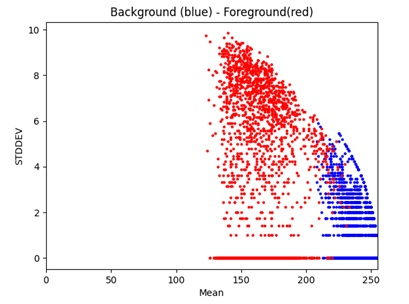

<table>
    <tr>
        <td>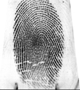</td>
        <td>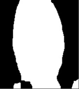</td>
        <td>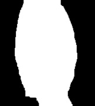</td>
    </tr>
</table>

<h3>Információ kinyerés</h3>

    Különböző irányú és értékű Gábor szűrők segítségével a barázdák kiegészíthetőek, hogy belőlük kinyerhetőek legyenek az úgynevezett minúciák. A Gábor szűrős felerősítés után a barázdák vázképét és heurisztikát használva különböző minúciákat tudunk kinyerni.

<table>
    <tr>
        <td>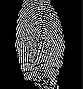</td>
        <td>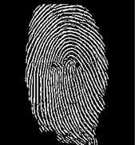</td>
        <td>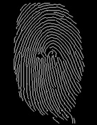</td>
    </tr>
</table>

Néhány esetben szükséges lehet a vázkép módosítására, hogy a felesleges minúciákat ellimináljuk. Ilyenek lehetnek olyan részek ahol a barázda vonalak megfelelő szögben állnak, de valami miatt megszakított, vagy ha egy barázda vonalból rövid elágazások indulnak ki.

<table>
    <tr>
        <td>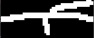</td>
        <td>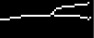</td>
    </tr>
</table>

<table>
    <tr>
        <td>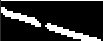</td>
        <td>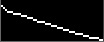</td>
    </tr>
</table>

Két féle típusú minúcia megjelenítése, a barázda lezáró minúciák elhagyásával.

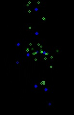

<table>
    <tr>
        <td>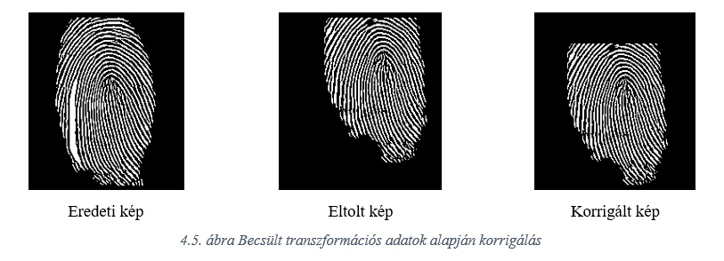</td>
    </tr>
        <tr>
        <td>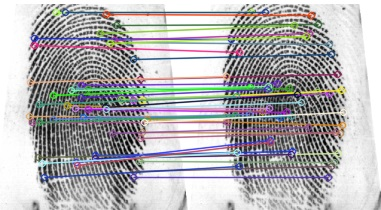</td>
    </tr>
</table>

<h2>
DIPLOMAMUNKA
 
Sári Gábor & Dr. Németh Gábor
 
2022
 
</h2>

